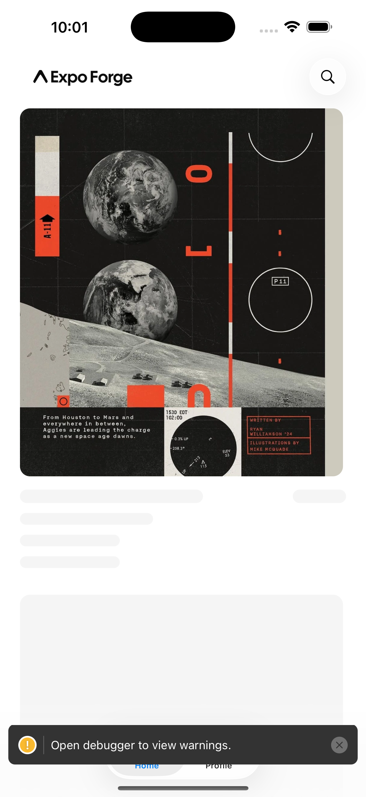
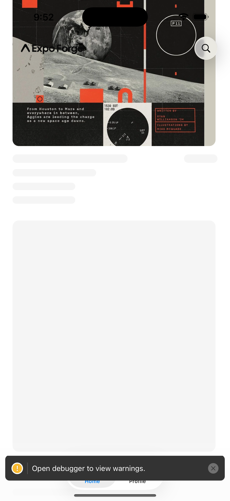

# ∧ / expo-forge

**Production-grade Turborepo template for Expo apps.**

<div>
  
  
  
</div>

## Overview

expo-forge is a production-grade [Turborepo](https://turborepo.com) template for [Expo](https://expo.dev) apps. It's designed to be a comprehensive starting point for building mobile applications, providing a solid, opinionated foundation with minimal configuration required.

Modeled on [next-forge](https://github.com/vercel/next-forge), expo-forge brings the same philosophy to native mobile: balance speed and quality to help you ship thoroughly-built products faster.

expo-forge is an independent community template and is not affiliated with Expo. Expo is a trademark of 650 Industries.

### Philosophy

expo-forge is built around five core principles:

- **Fast** — Quick to build, run, ship, and iterate on
- **Cheap** — Free to start with services that scale with you
- **Opinionated** — Integrated tooling designed to work together
- **Modern** — Latest stable features with healthy community support
- **Safe** — End-to-end type safety and robust security posture

## Status

expo-forge is a work in progress. The template itself builds and runs today; the `create-expo-forge` CLI is not yet published to npm. Until then, clone the repository directly. (The bare `expo-forge` npm name belongs to an unrelated package — the package will ship as `create-expo-forge`, installed via `bun create expo-forge`.)

## Screenshots

<div>
  
  
</div>

## Features

expo-forge comes with batteries included:

### Apps

- **Mobile** — Expo app with welcome, auth, home, and profile screens, built on expo-router native tabs (iOS 26 liquid glass) and a dev-client workflow (not Expo Go)

### Packages

- **Authentication** — Powered by [Clerk](https://clerk.com) via `@clerk/expo` — email code plus Apple/Google SSO
- **Backend** — [Supabase](https://supabase.com) client factory, an RLS example migration, and generated types
- **Design System** — Design tokens via [react-native-unistyles](https://www.unistyl.es) v3 (light/dark adaptive), Button/IconButton/Skeleton components, and a NavThemeProvider
- **System materials** — All glass surfaces (tab bar, header chrome, buttons) use real Liquid Glass APIs (SwiftUI `glassEffect`, `expo-glass-effect`), so they automatically respect the user's iOS 26 appearance setting (Clear/Tinted) and accessibility options like Reduce Transparency
- **Analytics** — Product analytics via [PostHog](https://posthog.com) (optional)
- **Observability** — Error tracking via [Sentry](https://sentry.io) (optional)
- **Payments** — In-app subscriptions via [RevenueCat](https://www.revenuecat.com) (optional)
- **Notifications** — Push notifications via expo-notifications
- **Updates** — Over-the-air updates via expo-updates
- **Environment** — `EXPO_PUBLIC_*` keys validated by [Zod](https://zod.dev) at boot with a composable `composeEnv` pattern
- **TypeScript Config** — Shared strict TypeScript configuration

Optional vendor packages no-op when their keys are unset — the app runs with just the required keys.

## Getting Started

### Prerequisites

- [Bun](https://bun.sh)
- Xcode (for iOS) or Android Studio (for Android)
- A [Clerk](https://clerk.com) application and a [Supabase](https://supabase.com) project (free tiers work)

### Installation

Clone the repository and install dependencies:

```sh
git clone <your-fork-or-this-repo> my-app
cd my-app
bun install
```

Once published, this becomes:

```sh
bun create expo-forge
```

### Setup

1. Copy `.env.example` to `.env` and fill in the required keys: your Clerk publishable key (`EXPO_PUBLIC_CLERK_PUBLISHABLE_KEY`) and Supabase URL and publishable key (`EXPO_PUBLIC_SUPABASE_URL`, `EXPO_PUBLIC_SUPABASE_KEY`)
2. Optionally add PostHog, Sentry, or RevenueCat keys — each vendor stays inert until its key is set
3. Build and run the dev client:

```sh
cd apps/mobile && bun ios
```

Environment variables are validated by Zod at boot, so misconfiguration fails loudly rather than at runtime.

## Structure

expo-forge uses a monorepo structure managed by Turborepo with Bun workspaces:

```
expo-forge/
├── apps/
│   └── mobile/              # Expo app (welcome, auth, home, profile)
├── packages/
│   ├── auth/                # Clerk (@clerk/expo)
│   ├── backend/             # Supabase client, RLS migration, types
│   ├── design-system/       # Unistyles tokens + components
│   ├── analytics/           # PostHog (optional)
│   ├── observability/       # Sentry (optional)
│   ├── payments/            # RevenueCat (optional)
│   ├── notifications/       # expo-notifications
│   ├── updates/             # expo-updates
│   ├── env/                 # Zod composeEnv pattern
│   └── typescript-config/   # Shared strict tsconfig
└── tooling/
    └── pins.json            # Single source for native-coupled versions
```

### Version pinning

Native-coupled dependency versions live in `tooling/pins.json` as the single source of truth: Expo SDK 57, React Native 0.86, React 19.2, and friends. Two pins are deliberate and load-bearing:

- `react-native-worklets` is pinned **exactly** to `0.10.0` (Expo's own pin — 0.10.1 crashes at launch)
- `react-native-reanimated` is a deliberate override at `^4.5.1`

### Known gotchas

- **Hoisted linker required** — `bunfig.toml` forces Bun's hoisted linker because Metro cannot resolve modules through Bun's default isolated layout. Don't remove it.
- **iOS deployment target 17.0** — required by `@clerk/expo`, set via `expo-build-properties`.
- **Dev client, not Expo Go** — the template uses native modules that require a development build (`bun ios`), not the Expo Go sandbox.

## Scripts

Run from the repository root:

```sh
bun dev         # turbo dev
bun typecheck   # turbo typecheck
bun lint        # turbo lint
bun run fix     # biome check --write .
```

Linting and formatting are handled by [Biome](https://biomejs.dev) 2.

## Roadmap

- CLI wizard (`create-expo-forge`) with schema-driven env prompts and optional-vendor removal
- Clerk-JWT Supabase RLS integration and webhook user sync
- Demo feed screen
- Convex backend variant
- EAS Workflows CI

## Contributing

We welcome contributions! See the [contributing guide](.github/CONTRIBUTING.md) for details.

## License

[MIT](license.md)

Expo is a trademark of 650 Industries. expo-forge is an independent community project.
